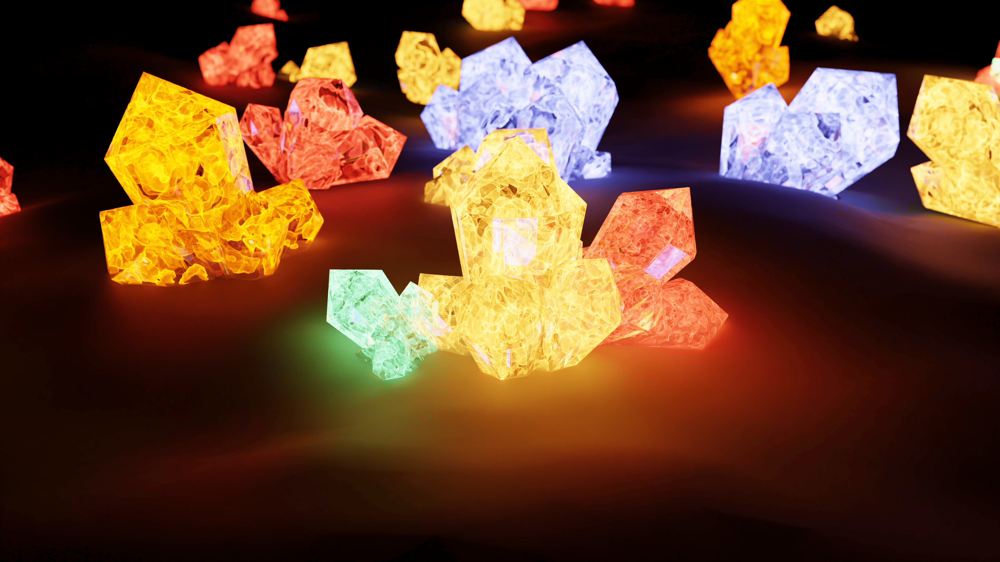

---English---

This is a Blender scene featuring glowing crystal materials created with Shader Nodes.

The scene focuses on colorful emissive crystals, soft lighting, and abstract energy-like surface details.

## Rendering Settings

- Rendering Engine: Cycles

- Sampling Rate: 1024

- Denoising: Enabled

---

---日本語---

これは、シェーダーノードを使用して制作した発光クリスタルの Blender シーンです。

カラフルな発光クリスタル、柔らかなライティング、エネルギーのような抽象的表現をテーマにしています。

## レンダリング設定

- レンダリングエンジン: Cycles
- サンプリングレート: 1024
- ノイズ除去: 有効

